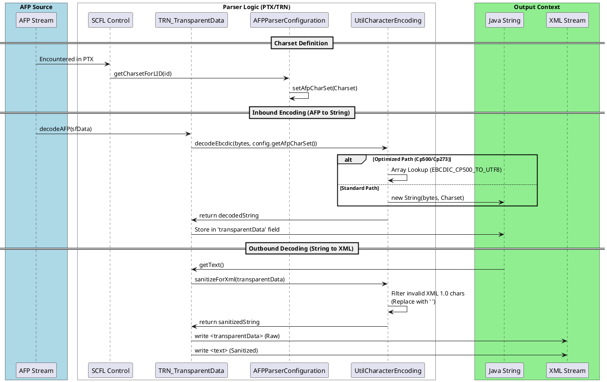

# TRN_TransparentData Processing: Specifications, Implementation, and Bottlenecks

## 1. Specifications (PTOCA Reference [PTOCA-4-589])

The **Transparent Data (TRN)** control sequence contains a sequence of code points that are presented without a scan for embedded control sequences.

### Syntax
| Offset | Type | Name | Range | Meaning |
| :--- | :--- | :--- | :--- | :--- |
| 0 | CODE | PREFIX | X'2B' | Control Sequence Prefix |
| 1 | CODE | CLASS | X'D3' | Control sequence class |
| 2 | UBIN | LENGTH | 2–255 | Control sequence length |
| 3 | CODE | TYPE | X'DA', X'DB' | Control sequence function type (X'DA' = Unchained, X'DB' = Chained) |
| 4–256 | CHAR | TRNDATA | N/A | Transparent data |

### Chaining (PTOCA Reference [PTOCA-4-046])
Control sequences may be chained together. Chaining is signaled by the presence of an odd function type (low-order bit is B'1').
- **Unchained (X'DA')**: The control sequence begins with the standard 4-byte introducer (Prefix, Class, Length, Type).
- **Chained (X'DB')**: The control sequence follows a preceding chained control sequence and begins with a 2-byte introducer (Length, Type), omitting the Prefix and Class bytes.

### Semantics
- Specifies a string of code points to be processed as graphic characters.
- No code point within the data field is recognized as a Control Sequence Prefix (CSP).
- The current inline position is incremented for each graphic character.

### Pragmatics
- **Double-Byte Fonts**: Data length must be even. If odd, the last byte is skipped ([PTOCA-4-595]).
- **Unicode**: If encoding is Unicode, code points must be valid Unicode; otherwise, the remainder is skipped.
- **Object Space**: If TRN causes character box to exceed object space, exception EC-0103 exists.

---

## 2. Implementation Details

### Data Model (`PTOCAControlSequence.TRN_TransparentData`)
- **Fields**:
  - `String transparentData`: The decoded string representation.
  - `byte[] transparentDataEBCDIC`: Raw EBCDIC bytes (used if `isUseEBCDICData` is true).
- **Decoding (`decodeAFP`)**:
  - Uses `UtilCharacterEncoding.decodeEbcdic` to convert raw bytes to a Java String based on the configured `AfpCharSet`.
- **XML Output (`getText`)**:
  - Invokes `UtilCharacterEncoding.sanitizeForXml(transparentData)` to ensure the string is safe for XML 1.0.
- **Encoding (`writeAFP`)**:
  - Either writes `transparentDataEBCDIC` directly or encodes `transparentData` back to the configured `AfpCharSet`.

### Serialization (`AfpJacksonXmlWriter`)
- Implements a manual StAX-based writer for `TRN_TransparentData` to avoid Jackson reflection overhead.
- Directly writes `transparentData` and `text` (sanitized) elements to the `XMLStreamWriter`.

### Charset Lifecycle and Logic
The processing of text within TRN sequences follows a stateful lifecycle from the raw AFP stream to the final XML output.

#### 1. Charset Definition
The active character set is managed by `AFPParserConfiguration`:
- **Default**: `Cp500` (International EBCDIC).
- **Resolution**: Mapped via `MCF` (Map Coded Font) structured fields using Local IDs (LID).
- **Activation**: Switched dynamically via the `SCFL_SetCodedFontLocal` control sequence within a PTX field.

#### 2. Inbound Encoding (AFP to Java)
- **Decoding**: Handled by `UtilCharacterEncoding.decodeEbcdic`.
- **Optimization**: Uses static lookup tables for `Cp500` and `Cp273` to bypass Java NIO overhead.
- **Storage**: Decoded UTF-16 strings are stored in the `transparentData` field.

#### 3. Outbound Decoding (Java to XML)
- **Sanitization**: `UtilCharacterEncoding.sanitizeForXml` replaces invalid XML 1.0 code points (e.g., EBCDIC control chars < 0x20) with a space (`0x20`).
- **Output**: The writer outputs both raw `<transparentData>` and sanitized `<text>` elements.

#### Logic Flow Diagram

---

## 3. Speed Bottlenecks

Based on analysis and `PTX_OPTIMIZATION_REPORT.md`, the following bottlenecks impact TRN processing:

### 1. Cumulative Volume of Small Elements
PTX fields often contain a massive number of small TRN sequences (e.g., thousands per document). Even with "fast-paths", the sheer number of object allocations and method calls adds up.

### 2. XML Sanitization Overhead
The `UtilCharacterEncoding.sanitizeForXml` method iterates through every character of the `transparentData` string to check `isValidXml10CodePoint`. For large documents with high text density, this O(N) check per TRN sequence becomes significant.

### 3. Character Decoding (EBCDIC to UTF-16)
Converting EBCDIC bytes to Java Strings during `decodeAFP` involves charset lookups and buffer conversions. While optimized for common charsets (Cp500, Cp273), it remains a CPU-intensive task when multiplied by 100k+ instances.

### 4. Instrumentation Jitter
If `MnemonicPerformanceMonitor` is active, every `writeStartElement` and `writeEndElement` for TRN sub-elements triggers `System.nanoTime()` and thread-local map lookups. This can dwarf the actual serialization time for small TRN payloads.

### 5. Redundant Formatting and Indentation
Writing `\n    ` (indentation) for every TRN sequence and its sub-elements (`<text>`, etc.) increases the XML size and adds to the I/O load.

### 6. String Allocations
The round-trip from `byte[]` (AFP) -> `String` (Java) -> `String` (Sanitized) -> `byte[]` (XML) creates significant garbage collection pressure in high-throughput environments.
